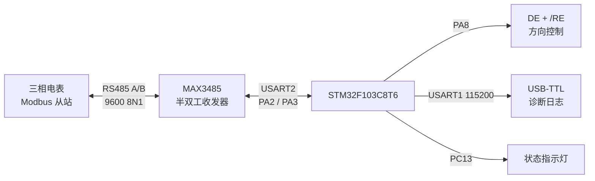

# STM32 Modbus-RTU 三相电参量采集终端

[](https://github.com/On-aroll/stm32-modbus-energy-terminal/actions/workflows/ci.yml)

基于 STM32F103C8T6 与 MAX3485 的配电侧三相电参量采集终端。固件作为 Modbus-RTU 主站，以 1 s 周期读取 10 个输入寄存器，完成 CRC16 校验、工程量换算、通信状态管理与串口诊断输出；仓库同时提供主机端协议仿真、自动化测试、接线说明和实物联调检查表。

## 当前验证状态

| 项目 | 状态 | 可复现证据 |
|---|---|---|
| Modbus CRC、请求组帧、响应解码及示例功率一致性 | 已通过 6 项主机端自动化测试 | `python -m unittest discover -v` |
| 示例报文端到端解析 | 已通过协议仿真 | `python tools/frame_lab.py` |
| 连续超时与自动恢复 | 已通过故障注入仿真 | `python tools/fault_lab.py` |
| STM32F103C8T6 固件 | PlatformIO 编译验证（Flash 32.7%，RAM 5.1%） | `pio run` 与 `results/build-report.md` |
| HAL 毫秒时基链接 | 已确认 SysTick 为强中断处理函数且保留 HAL_IncTick | `python tools/check_firmware_symbols.py` |
| 真实电表/RS485 台架 | 待实物验证 | `hardware/bringup-checklist.md` |

“编译通过”和“协议仿真”不等同于真实硬件测试。仓库保留了完整的台架测试模板，待接入实物后补充照片、串口日志和测试结论。

## 系统结构



每轮采集按以下顺序执行：

1. 生成 `0x04 Read Input Registers` 请求并追加 Modbus CRC16；
2. PA8 拉高，切换 MAX3485 到发送模式；
3. 等待 UART 发送完成后 PA8 拉低，立即回到接收模式；
4. 校验从站地址、功能码、字节数和 CRC；
5. 将 10 个寄存器缩放为电压、电流、功率、功率因数、频率和负载率；
6. 更新在线/降级/通信中断状态，并通过 USART1 输出诊断信息。

## 默认寄存器

默认从地址 `0x0000` 连续读取 10 个输入寄存器。具体映射见 [`docs/register-map.md`](docs/register-map.md)。不同电表厂商的地址和缩放通常不同，接入真实设备前必须按说明书调整。

请求示例：

```text
01 04 00 00 00 0A 70 0D
```

仿真响应解析结果：

```text
Ua=230.1 V  Ub=229.7 V  Uc=230.4 V
Ia=32.1 A   Ib=30.8 A   Ic=31.5 A
P=20.7 kW   PF=0.952    F=50.01 Hz  Load=72.1 %
```

## 快速复现

### 1. 主机端协议测试

仅需 Python 3.10 及以上版本，无第三方依赖：

```bash
python -m unittest discover -v
python tools/frame_lab.py
python tools/fault_lab.py
```

后两条命令分别生成 `results/protocol-report.json` 与 `results/fault-injection-report.json`，记录报文解码和“正常—连续超时—恢复”状态变化。

### 2. 编译固件

安装 [PlatformIO Core](https://docs.platformio.org/en/latest/core/installation/index.html) 后执行：

```bash
pio run
python tools/check_firmware_symbols.py
```

链接检查会拒绝指向默认死循环的弱 `SysTick_Handler`。工具链使用自定义安装位置时，可给脚本传入 `--nm /path/to/arm-none-eabi-nm`。

接入 ST-LINK 后可执行：

```bash
pio run -t upload
pio device monitor -b 115200
```

上电前请先阅读 [`hardware/wiring.md`](hardware/wiring.md) 和 [`hardware/bringup-checklist.md`](hardware/bringup-checklist.md)。

## 故障处理策略

| 条件 | 状态 | 行为 |
|---|---|---|
| 首次启动或单次失败 | `DEGRADED` | 翻转指示灯，记录失败次数 |
| 连续失败少于 3 次 | `DEGRADED` | 保持轮询，等待链路恢复 |
| 连续失败达到 3 次 | `COMMUNICATION_LOST` | 输出通信中断状态，继续重试 |
| 任一有效响应 | `ONLINE` | 清零连续失败次数，恢复正常显示 |

这种设计避免一次偶发超时直接触发通信中断，同时无需人工复位即可在链路恢复后回到在线状态。

## 目录结构

```text
.
├── include/                 # 板级引脚配置
├── lib/
│   ├── fault_manager/       # 通信状态机
│   ├── meter_protocol/      # 寄存器到工程量的转换
│   └── modbus_rtu/          # RTU CRC、组帧与校验
├── src/main.c               # HAL 初始化与轮询主循环
├── tools/                   # 主机端报文工具和仿真脚本
├── tests/                   # Python 协议测试
├── hardware/                # BOM、接线、联调与测试记录
├── docs/                    # 寄存器表和设计说明
└── results/                 # 可复现的构建/协议报告
```

## 可继续扩展

- 按具体电表说明书增加 32 位有符号功率、组合字节序和倍率配置；
- 将阻塞式接收改为 DMA + 空闲中断，增加环形缓冲区；
- 增加参数掉电保存、OLED 本地显示和越限告警；
- 引入隔离型 RS485、电源浪涌与 ESD 保护，完善现场工程化设计；
- 实物测试后增加丢帧率、恢复时间和长时间运行统计。

## English summary

This repository implements an STM32F103C8T6 Modbus-RTU energy-meter terminal with RS485 direction control, CRC validation, register scaling, communication-state recovery, host-side frame simulation, tests, and a documented hardware bring-up procedure. Firmware compilation and host protocol tests are reproducible; physical meter validation remains explicitly pending.

## 参考与许可

协议与平台参考见 [`ACKNOWLEDGMENTS.md`](ACKNOWLEDGMENTS.md)。项目代码采用 [MIT License](LICENSE)。
